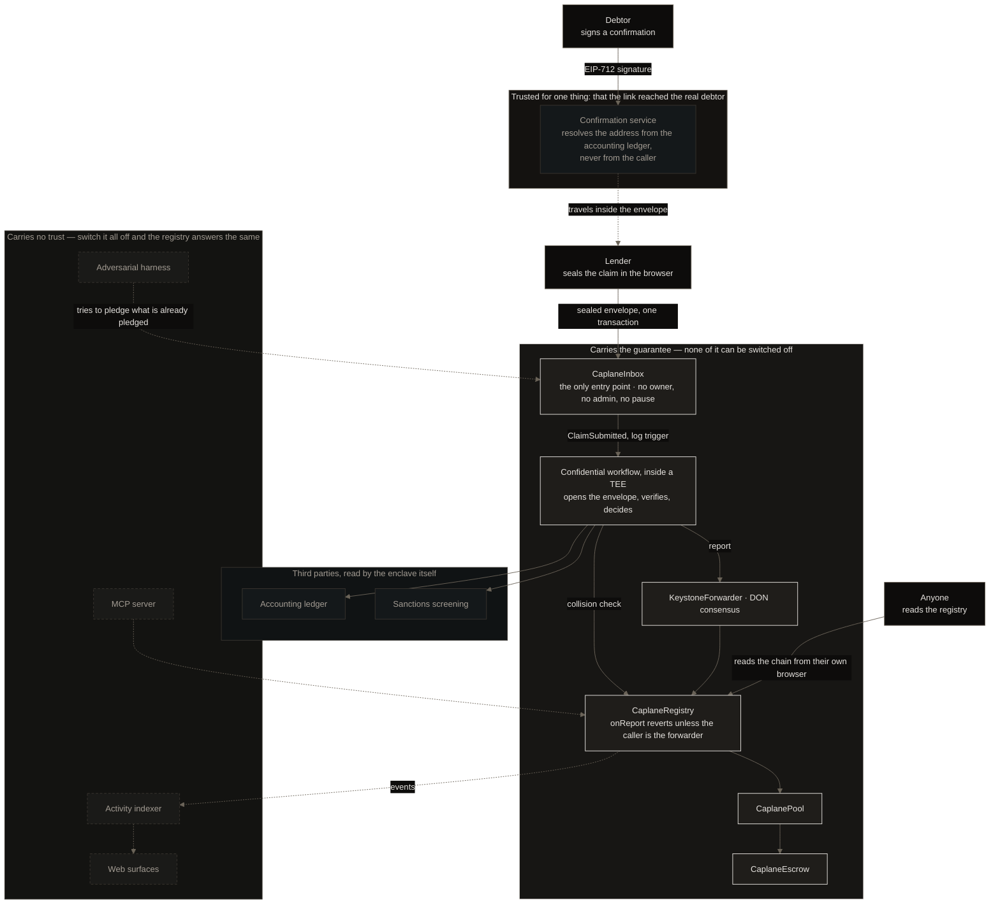

<p align="center">
  
</p>

<h1 align="center">Caplane</h1>

<p align="center">
  <strong>An encrypted lien registry, writable only from inside a TEE</strong>
</p>

<p align="center">
  The same invoice can&apos;t be pledged twice.
</p>

<p align="center">
  <a href="#try-it-without-installing-anything">Try it</a> ·
  <a href="#how-it-works">How it works</a> ·
  <a href="#what-each-sponsor-asked-for">Sponsors</a> ·
  <a href="#architecture">Architecture</a> ·
  <a href="#deployed-on-arc-testnet">Contracts</a> ·
  <a href="#run-it-locally">Run locally</a> ·
  <a href="#what-is-not-built">Limits</a>
</p>

---

## The problem

A receivable can be pledged to two lenders at once, and neither finds out until both try to collect.
Off-chain this is solved by public collateral registries — the UCC-1 filing in the United States.
On-chain there is nothing equivalent, and the obvious construction fails twice over: a public
registry leaks every business&apos;s customers, amounts and terms to its competitors, while a private
one is only as honest as whoever operates it.

| | Sees your book | Operator can alter it | Answers without asking us | Refuses a second pledge |
|---|:---:|:---:|:---:|:---:|
| A public on-chain registry | Everyone | No | Yes | Exact match only |
| A private registry with an operator | The operator | **Yes** | No | Yes |
| Not filing at all | Nobody | — | — | No |
| **Caplane** | **Nobody, including us** | **No** | **Yes** | **Yes, including reformatted** |

The last column is the hard part. Two lenders describe the same invoice differently — `ORC-1043`
against `ORC1043`, `275000.00` against `27500000`, a date written day-first. An exact-match registry
misses the collision and records the second lien. Caplane matches on six of seven canonical
components, a threshold calibrated against 903 pairs of real invoices rather than chosen.

---

## Try it without installing anything

Everything below is live on Arc Testnet right now.

| Surface | What it does |
|---|---|
| [caplane.xyz](https://caplane.xyz) | The thesis, the evidence, and the architecture diagram |
| [registry.caplane.xyz](https://registry.caplane.xyz) | **Public lookup.** No account, no key. Reads the chain from your own browser |
| [app.caplane.xyz](https://app.caplane.xyz) | Sign up, pledge a receivable, see your claims, fund the pool |
| [app.caplane.xyz/harness](https://app.caplane.xyz/harness) | **The adversarial worker**, live: the same pledged receivable attempted again and again, refused every time |
| [api.caplane.xyz/health](https://api.caplane.xyz/health) | The indexer and the confirmation channel |

Read a real lien without trusting anything of ours:

```bash
curl -s https://rpc.testnet.arc.io -H 'content-type: application/json' -d '{
  "jsonrpc":"2.0","id":1,"method":"eth_call","params":[{
    "to":"0xe7170ee0ce4cab4593970ef5c4ebf7d0d62ae19b",
    "data":"0xc7df14e2ebd60de9b8c99e6bde3ce7ad1894177e706e75c0120c192da71400a378ae7e4c"
  },"latest"]}'
```

`0x…01` is Active. Switch off every service we run and that call answers the same.

---

## How it works

A business pledges a receivable to a lender. Nothing about the receivable is ever public.

```
  1. The lender fills in the invoice and asks the debtor to confirm.
     The confirmation service resolves the debtor's address from the accounting
     ledger itself — never from the caller — and mails a one-time link.

  2. The debtor signs an EIP-712 confirmation of the exact figures. That signature
     travels back inside the sealed envelope; it never sits on a server of ours.

  3. The lender's browser seals the claim to the enclave's public key and sends
     ONE transaction to the inbox. 886 bytes of ciphertext. No plaintext field.

  4. The inbox emits a log. A Chainlink CRE confidential workflow wakes up INSIDE
     A TEE, decrypts the envelope, and — without any of it leaving the enclave —
       · fetches the invoice from the accounting ledger and compares it exactly
       · screens the counterparty against the sanctions list
       · recovers the debtor's signature and checks it binds this exact claim
       · asks the registry whether six of seven components already match a lien

  5. The DON reaches consensus and the forwarder writes the verdict. The registry
     accepts a write from nobody else. Either LienRecorded or SubmissionRejected
     with a reason code — and a refusal says why without saying to whom.
```

**What the chain sees:** a submission id, a sealed envelope, and one word of verdict.

**What stays inside the enclave:** the invoice number, the amount, the debtor, the due date, the
accounting credential, the sanctions response, and the pepper that salts the registry key.

Measured end to end: **68,350 gas** to submit, **28 blocks** to a verdict, about fourteen seconds.

---

## Demo video

> **[Watch the demo →](#)** *(link pending)*

---

## What each sponsor asked for

### Chainlink — Confidential Workflows

> *"Use Confidential Workflows for a significant part of the app · register and use a TEE handler
> (`handlerInTee`) · process at least one sensitive input inside the enclave · a meaningful
> integration, not a decorative handler · demonstrate execution with evidence."*

| Requirement | Where | Evidence |
|---|---|---|
| `handlerInTee`, registered | [`caplane-workflow/workflow.ts:242`](caplane-workflow/workflow.ts) — **two** handlers, one per trigger | [`evidence/cre/02-simulate.txt`](evidence/cre/02-simulate.txt) |
| A sensitive input, inside the enclave | The sealed claim, the Vault secrets, the ledger credential, the sanctions response, the collision pepper | [`evidence/cre/07-envelope.txt`](evidence/cre/07-envelope.txt) |
| Significant, not decorative | The enclave **is** the product. Nothing else may write the registry | [`evidence/cre/18-full-cycle.txt`](evidence/cre/18-full-cycle.txt) |
| Demonstrated execution | Deployed and executed, not only simulated. Workflow ID `006818407c…` | [`evidence/cre/04-deploy.txt`](evidence/cre/04-deploy.txt) |

**We ran the published must-pass list against ourselves, point by point:**
[`evidence/repo/02-sponsor-rubric.md`](evidence/repo/02-sponsor-rubric.md). Sixteen points, each
claiming exactly one kind of proof — a gate that would catch a regression, a measurement on disk, or
an argument. Five of them are decidable by reading the workflow source, so a CI job decides them
rather than taking our word: `scripts/rubric/check.ts`.

The simulation banner echoes the **resolved** TEE constraint — AWS Nitro, `us-west-2` — so the
constraint literal parsed rather than being accepted as text, and production limits were enforced
instead of the simulator&apos;s permissive defaults.

The determinism audit is in
[`evidence/cre/14-determinism-audit.txt`](evidence/cre/14-determinism-audit.txt). No `Date.now()`,
no `Math.random()`, no unsorted map iteration, no `ConfidentialHTTPClient` inside a TEE handler, and
we do **not** claim the workflow binary is confidential — the DON sees it; only the data it computes
over stays inside.

### Arc — functional MVP on Arc

> *"A working frontend and backend plus an architecture diagram · demo video · detailed
> documentation · repo · deployed or deployment-ready on Arc mainnet."*

| Requirement | Where |
|---|---|
| Working frontend | Six live surfaces, [listed above](#try-it-without-installing-anything) |
| Working backend | [`api.caplane.xyz`](https://api.caplane.xyz/health) — chain indexer and the debtor confirmation channel |
| Architecture diagram | [Below](#architecture), and on the landing page |
| Deployed on Arc | Four contracts, verified, [addresses below](#deployed-on-arc-testnet) |
| Detailed documentation | This file, [`THREATMODEL.md`](THREATMODEL.md), [`RELATED-WORK.md`](RELATED-WORK.md), [`evidence/`](evidence/) |

Arc is not a deployment target of convenience here. The registry settles in native USDC, and Arc&apos;s
USDC-as-gas is what lets a business pay for a filing in the same unit it is financing in. Chain
conformance is measured rather than assumed:
[`evidence/arc/04-conformance.txt`](evidence/arc/04-conformance.txt).

### Privy — a B2B flow with a real control

> *"Privy as a core part · at least one Privy wallet · an enterprise use case · at least one working
> B2B flow · at least one Privy control: policies, signers, key quorums or intents."*

| Requirement | Where | Evidence |
|---|---|---|
| Privy wallet | Organization treasury wallet, created at sign-up | [`web/app/api/organizations/route.ts`](web/app/api/organizations/route.ts) |
| Enterprise use case | A company pledges its receivables. The actor is a business, not a person | [`app.caplane.xyz/signup`](https://app.caplane.xyz/signup) |
| A working B2B flow | Treasury transfer, authorised against the signed-in person | [`web/app/api/organizations/transfer/route.ts`](web/app/api/organizations/transfer/route.ts) |
| **A Privy control** | **Policy**: transfers at or above a threshold are denied by Privy itself, not by our code | [`evidence/privy/03-denial.json`](evidence/privy/03-denial.json) |

The denial is the interesting artifact. It is Privy&apos;s own refusal, captured as a raw HTTP exchange
([`04-denial.http`](evidence/privy/04-denial.http)) — not our server declining to call. A control
that only our code enforces is not a control.

---

## Architecture


---

## Deployed on Arc Testnet

Chain ID `5042002`. Source verified — full match, not partial — so the explorer&apos;s read tab works
without an account.

| Contract | Address | What it does |
|---|---|---|
| `CaplaneInbox` | [`0xc5218fd1b6eb7c91f905871301bf8620bc8baf91`](https://testnet.arcscan.app/address/0xc5218fd1b6eb7c91f905871301bf8620bc8baf91) | The only entry point. No owner, no admin, no pause |
| `CaplaneRegistry` | [`0xe7170ee0ce4cab4593970ef5c4ebf7d0d62ae19b`](https://testnet.arcscan.app/address/0xe7170ee0ce4cab4593970ef5c4ebf7d0d62ae19b) | The record. Writable only by the DON forwarder |
| `CaplanePool` | [`0x4df4c8d722b3a9ebd18b9094c883b5ff83565d7c`](https://testnet.arcscan.app/address/0x4df4c8d722b3a9ebd18b9094c883b5ff83565d7c) | ERC-4626 vault that funds the advances |
| `CaplaneEscrow` | [`0x2bc74ceb10287890fb9be43667a55b73e080db1f`](https://testnet.arcscan.app/address/0x2bc74ceb10287890fb9be43667a55b73e080db1f) | Where the debtor pays, and where the split happens |

Nobody can alter an entry, including us. Check it in one command:

```bash
grep -q onlyOwner contracts/src/CaplaneRegistry.sol || echo "no owner, no admin, no pause"
```

⚠️ **A lien id is not derivable from the receivable.** The registry key is salted with a secret that
never leaves the enclave, so holding the document tells you nothing about whether it is pledged.
Query a lien id you were given, or enumerate by borrower address with `@caplane/sdk`. And
`isEncumbered` is the wrong place to start: it is `status == 1` and nothing else, so a released lien
and an id that was never written both answer `false`. The pages show the word, never the boolean.

---

## Tests — 295, and the negative controls that make them mean something

| Suite | Tests | Where |
|---|:---:|---|
| Contracts (Foundry) | 138 | [`contracts/test/`](contracts/test/) |
| Everything else | 157 | `claim/`, `caplane-workflow/`, `sdk/`, `web/`, `site/`, `services/`, `scripts/` |

A green suite proves nothing on its own, so the ones worth reading are the refusals:

| What it proves | Where |
|---|---|
| An unreadable registry is `undecidable`, never `clear` — a failed read must not read as "nothing pledged" | [`evidence/cre/10-collision-check.txt`](evidence/cre/10-collision-check.txt) |
| The four invoice fields are absent from the chain **and present** in the opened envelope — the same search, both ways | [`evidence/web/03-submission-flow.txt`](evidence/web/03-submission-flow.txt) |
| A refusal is not counted as a bounce unless the target is still encumbered and the registry answers for itself | [`evidence/harness/01-continuous-refusal.txt`](evidence/harness/01-continuous-refusal.txt) |
| A budget with no measurement behind it is a violation, not a pass | [`scripts/budgets/check.ts`](scripts/budgets/check.ts) |

[`evidence/`](evidence/) holds 98 reproducible artifacts with [an index](evidence/README.md). Every
transaction hash in it was re-checked against the chain on 2026-09-13: fifteen transactions, all
present, all successful.

---

## Run it locally

### Prerequisites

| Tool | Version |
|---|---|
| Node | 22 LTS |
| Bun | 1.2.21 |
| Foundry | `circlefin/arc-foundry` v0.8.0-1, pinned by sha256 |
| solc | 0.8.28 |
| `cre` CLI | 1.33.0 |

Two package managers by design: `caplane-workflow/` uses Bun because the Chainlink CRE SDK requires
it; everything else uses npm. Each directory installs independently — there is no workspace linkage.

```bash
git clone https://github.com/DavidZapataOh/caplane-ethglobal.git
cd caplane-ethglobal/caplane

# Contracts — 138 tests, no network
cd contracts && arc-forge test -vvv && cd ..

# The claim encoding, in both runtimes
cd claim && bun test && cd ..

# The workflow, hermetically
cd caplane-workflow && bun test && cd ..

# The repository's own gates
cd scripts/hygiene && bun test && bun run check.ts && cd ../..

# The public registry page
cd web && npm ci && npm run dev     # http://localhost:3000/registry
```

Simulating the confidential workflow needs a CRE login and real credentials; the command and the
expected banner are in [`evidence/cre/02-simulate.txt`](evidence/cre/02-simulate.txt).

---

## Project structure

```
caplane/
├── contracts/          Solidity, Foundry. Registry, inbox, pool, escrow
├── caplane-workflow/   The Chainlink CRE confidential workflow — two TEE handlers
├── claim/              Canonicalisation, the commitment index, the sealed envelope
├── sdk/                @caplane/sdk — read the registry from anywhere
├── web/                The app: sign up, pledge, claims, invest, public lookup, harness panel
├── site/               The landing page
├── services/           api (indexer + debtor confirmation), mcp, adversarial harness
├── scripts/            The repository's gates: hygiene, budgets, generated docs
└── evidence/           98 reproducible artifacts, indexed
```

---

## What is not built

Every project has these. Most do not write them down.

| | |
|---|---|
| **Trust rests on the enclave** | Confidentiality is hardware attestation, not pure cryptography. If the TEE is broken, the plaintext is readable. We say so rather than claim a ZK property we do not have |
| **Pre-emptive poisoning is open** | Anyone can pledge a receivable that is not theirs and block it, for $0.00094. Not closeable against the frozen interface. Priced and declared in [`THREATMODEL.md`](THREATMODEL.md) rather than called mitigated |
| **Reformatting resistance is off-chain** | The ledger pins the invoice number, amount, currency and due date before the collision check sees them, so on chain only an exact match can be observed. The tolerance is real and measured — against the matcher the enclave itself runs — and it is stated where it lives |
| **The confirmation channel is the weakest link** | The enclave cannot prove the key that signed belongs to the debtor. The anchor is that the link reached an address only the accounting ledger knows |
| **One receivable** | The registry holds a single lien. It was recorded, released, and recorded again — everything demonstrated here happened to that one claim |

The full six-variant threat model, with a code anchor for every closure, is in
[`THREATMODEL.md`](THREATMODEL.md). Where this design departs from the three papers that describe
the same problem is in [`RELATED-WORK.md`](RELATED-WORK.md).

---

## Attribution

This product uses the International Trade Administration&apos;s Data API but is not endorsed or
certified.

## License

MIT

---

<p align="center">
  <em>The same invoice can&apos;t be pledged twice.</em>
</p>

<p align="center">
  Built for <a href="https://ethglobal.com/events/ethonline2026">ETHOnline 2026</a> —
  Chainlink CRE · Arc · Privy
</p>
