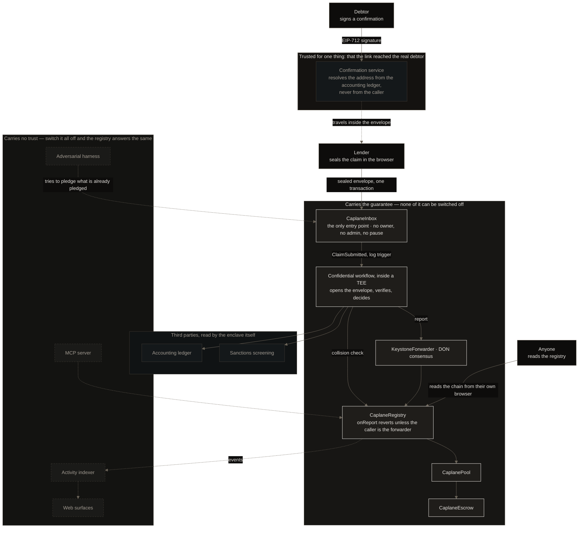

# Caplane

An encrypted lien registry, writable only from inside a TEE.

Two package managers by design: `caplane-workflow/` uses Bun because the
Chainlink CRE SDK requires it; everything else uses npm. Each directory
installs independently — there is no workspace linkage.

## Architecture



**What can be switched off.** Everything in the dashed box is a convenience. The activity indexer,
the MCP server, the harness and the web surfaces hold no authority and no state the registry needs:
stop all four and a lien still reads the same, because the public lookup reads the chain from the
visitor's own browser with nothing of ours in the path. This is demonstrated rather than claimed —
the rehearsal stops `api.caplane.xyz` on camera and queries the registry afterwards.

**What cannot.** The inbox is the only way in and has no owner, no admin and no pause. The registry
accepts a write only from the DON's forwarder, under the right workflow owner and name; there is no
operator key and no upgrade path, so no one — including us — can edit an entry. The enclave is where
the claim is decrypted and decided, and it is the only place the plaintext exists.

**One thing sits between.** The confirmation service is not a convenience and is not trusted with the
record either. The enclave cannot establish that the key which signed a confirmation belongs to the
debtor — the accounting ledger holds no chain address — so the whole anchor is that the link arrived
at an address only the ledger knows. That service resolves the address itself and never accepts one
from the caller. It is the weakest link in the chain and is declared as such rather than hidden.

## Threat model and related work

- [`THREATMODEL.md`](THREATMODEL.md) — six attack variants. Five are closed and each names the line
  that closes it; one is priced and left open, because a mitigation that does not exist is not one.
- [`RELATED-WORK.md`](RELATED-WORK.md) — three papers that describe this problem, and where this
  design departs from each. One of the three it does not depart from at all, and says so.

Both are generated from `scripts/docs/`. Editing them by hand fails CI.

## Toolchain

Pinned so a clean machine reproduces this build:

| Tool | Version |
|---|---|
| Node | 22 LTS |
| Bun | 1.2.21 |
| Foundry | `circlefin/arc-foundry` v0.8.0-1, pinned by sha256 |
| solc | 0.8.28 |
| `cre` CLI | 1.33.0 |

## Layout

| Directory | What |
|---|---|
| `contracts/` | Solidity, Foundry |
| `caplane-workflow/` | Chainlink CRE confidential workflow |
| `claim/` | Claim encoding, shared by the workflow and the SDK |
| `sdk/` | `@caplane/sdk` |
| `web/` · `site/` | Next.js surfaces |
| `services/` | api, mcp, adversarial harness |
| `scripts/` | Repository gates and live dependency probes |
| `evidence/` | Reproducible execution artifacts |

## Deployed on Arc Testnet

| Contract | Address |
|---|---|
| `CaplaneInbox` | [`0xc5218fd1b6eb7c91f905871301bf8620bc8baf91`](https://testnet.arcscan.app/address/0xc5218fd1b6eb7c91f905871301bf8620bc8baf91) |
| `CaplaneRegistry` | [`0xe7170ee0ce4cab4593970ef5c4ebf7d0d62ae19b`](https://testnet.arcscan.app/address/0xe7170ee0ce4cab4593970ef5c4ebf7d0d62ae19b) |
| `CaplanePool` | [`0x4df4c8d722b3a9ebd18b9094c883b5ff83565d7c`](https://testnet.arcscan.app/address/0x4df4c8d722b3a9ebd18b9094c883b5ff83565d7c) |
| `CaplaneEscrow` | [`0x2bc74ceb10287890fb9be43667a55b73e080db1f`](https://testnet.arcscan.app/address/0x2bc74ceb10287890fb9be43667a55b73e080db1f) |

Source is verified — full match, not partial — so the explorer's read tab works without an account:
open the registry and call `statusOf(bytes32)` or `lienOf(bytes32)` on a lien id. It answers from
chain state; there is no server in the path and nothing to ask permission from. The same tab reads
the four immutables that pin who may write.

⚠️ **A lien id is not derivable from the receivable.** The registry key is salted with a secret that
never leaves the enclave, so holding the document tells you nothing. Ask about a lien id you were
given, or enumerate by borrower address with `@caplane/sdk`. `isEncumbered` is also the wrong place
to start looking: it is `status == 1` and nothing else, so a released lien and an id that was never
written both answer `false`.

Nobody can alter an entry, including us. The registry has no owner, no pause and no upgrade path,
and its only writer is a DON-consensused report from an attested enclave:

```bash
! grep -q onlyOwner contracts/src/CaplaneRegistry.sol && echo "no owner, no admin, no pause"
```

The workflow name is hashed into the registry as an immutable and reads back as
`0x33396465656661623966` — `caplane-registry`. Deployment cost, addresses, the compile profile
and what is deliberately still zero are in `evidence/deploy/06-contracts.txt`.

## Attribution

This product uses the International Trade Administration's Data API but is not endorsed or
certified.

## License

MIT
